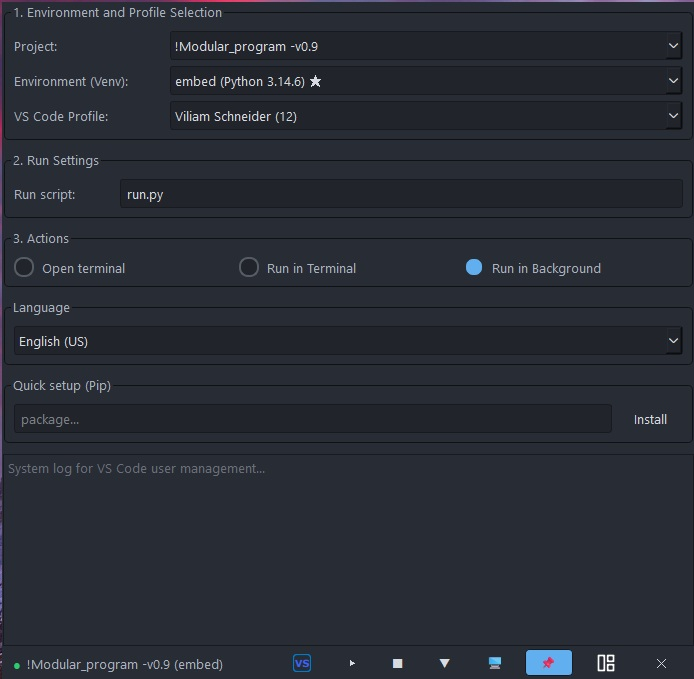
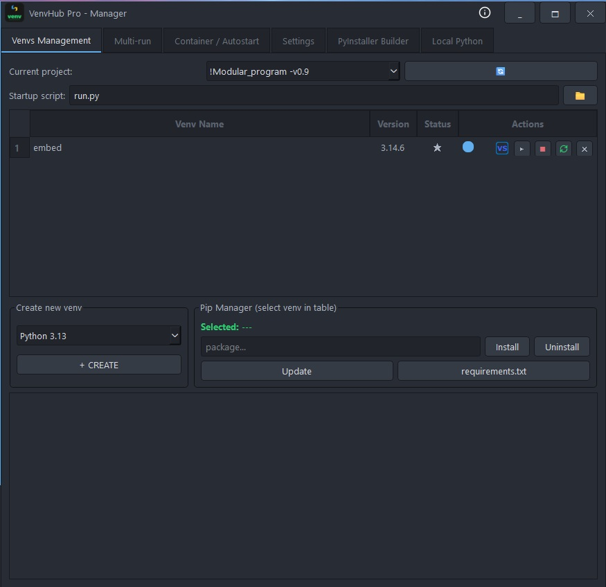

# 🚀 VenvHub Pro
## Ultimate Python Environment Manager & Orchestrator for Windows

### 📝 Overview
VenvHub Pro is a comprehensive, IDE-agnostic management tool for Python developers. It solves real-world problems like dependency hell, project portability, microservice orchestration, and .exe packaging—replacing multiple tools with one smooth, asynchronous, responsive application.

**Version:** v2.5.16  
**Developer:** Ing. Viliam Schneider  
**Partner / Deployed at:** Seal and Lube, spol. s r.o.

---

## Screenshot

---

### ✨ Key Features

#### 📁 Environment Separation Architecture
Physically separates your source code from virtual environments. Projects stay clean while all Venvs are centrally managed in a dedicated Venv Hub folder. Delete a Venv without touching your code.

#### 🚀 Mini-Bar & Quick Settings
A floating toolbar that provides maximum control in minimal screen space. Quick-switch projects, environments, launch scripts, and even change language or themes—without opening the main Manager window.

#### 📦 Dual-Scan Pip Manager with UV Autopilot
Extremely fast package manager using parallel scanning to detect outdated libraries. When using the **uv** installer, after updates VenvHub performs a deep compatibility check and automatically fixes dependency conflicts by downgrading broken packages.

#### 🔄 Container & Autostart (Venv Orchestrator)
Group Venvs (Frontend, Backend, DB) into "Containers." VenvHub launches them in precise order with timers and signal "Anchors (Hooks)" guaranteeing startup. A Watchdog monitors PIDs and intelligently respawns crashed processes up to 3 times.

#### 🛠 PyInstaller Builder with Auto-Injector
Visual .exe creation tool. Not only does it bundle the `uv.exe` installer and generate a "Birth Certificate" (JSON metadata with Python version), but its Auto-Injector reads linked local packages and dynamically injects their source code and assets into the build.

#### 🐍 Local Embeddable Runtimes
Download "Local" Python versions from official ZIP archives—no Windows installation required (no registry or PATH modifications). VenvHub automatically "hacks" and fixes them (installs Pip, unlocks site-packages) to behave like full installations.

#### 🔗 Local Packages (Shared Libraries)
Link your custom code across multiple projects without copying or installing. Uses a clean Python Import Hooks architecture (`sys.meta_path`)—no UAC required, no junctions on disk. Fully compatible with VS Code IntelliSense and PyInstaller builds.

#### 💻 Isolated VS Code User Profiles
Each profile has its own extensions, settings, and keybindings. Perfect for teams or switching between projects with different requirements. Profiles are completely portable—keep them on a USB drive and use them anywhere.

#### 🔌 VS Code Integration
Automatically syncs selected Venv to VS Code's `settings.json` (`python.defaultInterpreterPath`), injects local package paths into `python.analysis.extraPaths`, and even adds custom Tasks/Keybindings from `local_meta.json`. Supports portable path correction for USB drives.

#### 🧳 Portable Mode & Hardware Locking
Work from a USB drive? VenvHub detects drive letter changes and auto-corrects all paths. Hardware ID hashing prevents incompatible system Venvs from running on other machines—keeping your code safe.

#### 🎨 Dual-Theme with AI Modding
Modern UI built on a robust PyQt6/PySide6 bridge running fully asynchronously. Includes built-in and user-created QSS themes. Let AI recolor a skin and import it back with one click!

#### ⚙️ Ultra-Fast UV Installer Support
Optional use of the **uv** package installer (written in Rust) for 10-100x faster installations and automatic dependency conflict resolution.

---

### 📚 Full Documentation
This README provides an overview. The complete user manual is included directly in the application as offline HTML help files (within the `manual/` directory) for immediate access, covering:
*   Installation & First Run
*   Mini-Bar & Quick Settings
*   Environment Manager
*   Pip Package Manager
*   Multi-Run (Batch Launching)
*   PyInstaller Builder
*   Settings & Themes
*   Local Python Runtimes
*   Container & Autostart
*   Local Packages (Linker)
*   Editable Packages (pip -e)
*   VS Code User Profiles
*   VS Code Integration
*   Architecture & Compilation
[cite: 12]

---

### 🔧 Installation

#### Classic Windows Installer
*   Standard installation (e.g., `C:\Program Files\VenvHubPro`)
*   Data stored in `%APPDATA%\VenvHubPro\`
*   Per-user settings and themes

#### Portable Version
*   Extract to any folder (including USB drives) [cite: 13, 15]
*   All data stored alongside the executable
*   Recognized by presence of `_is_portable.ini` marker file
*   Auto-corrects drive letter changes

---

### 🏗️ Architecture

#### Dual-Framework Bridge
Written for PyQt6 but includes a Compatibility Bridge (`pyqt_to_pyside.py`) using `MetaPathFinder` [cite: 12]. If the environment has PySide6, the bridge silently intercepts all PyQt6 imports and redirects them to PySide6 at runtime [cite: 12].

#### Self-Replication (Dogfooding)
VenvHub Pro can compile itself using its own PyInstaller Builder [cite: 12]. This guarantees the builder is production-ready and capable of packaging even complex applications [cite: 12, 16].

#### Build Process
*   UI files (`*.ui`) are loaded dynamically [cite: 12]
*   PyInstaller builds with either PyQt6 or PySide6 (hidden imports needed for PySide6) [cite: 12]
*   NSIS installer script wraps the built `dist/VenvHubPro` folder

---

### 📬 Contact / Kontakt
*   **Bug Reports & Feature Requests:** Please open an Issue right here on GitHub.
*   **Business Inquiries & Collaboration:** Please visit my [GitHub Profile](https://github.com/tvoje-meno) where you can find my verified contact details.